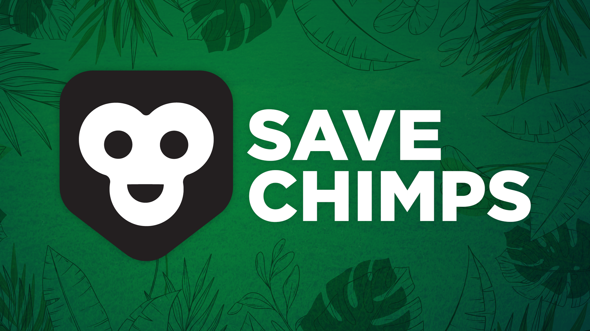

<!-- PROJECT LOGO -->
 

  

  <h3 align="center">Save Chimps</h3>

  

    <a href="https://github.com/sarthakarora1208/save-chimps"><strong>Explore the docs »</strong></a>
     
    Mine opinions and analyse sentiments anywhere on the internet.
     
    <a href="https://youtu.be/eaTFKP7jum0">View Demo</a>
    ·
    <a href="https://github.com/sarthakarora1208/save-chimps/issues">Report Bug</a>
    ·
    <a href="https://github.com/sarthakarora1208/save-chimps/issues">Request Feature</a>
  

## Inspiration

We came across this hackathon and wanted to help straight away. We need to take whatever steps we can to protect the endangered Eastern Chimpanzee species. Being full-stack web developers we knew this was something we could build. 

## What it does
The idea is to change collaboratory mapping forever one step at a time. To start we are focused on solving Jane Godall Institute's problem. We have built a web application that helps Jane Godall Institute to faster review, change, update and approve the changes to the Eastern Chimpanzee Range dynamic conservation maps. Leveraging Esri’s ArcGIS Online platform and the DocuSign eSignature API, we have hypothesized a frictionless process. This process makes communication between the multiple stakeholders & GIS Users a piece of cake and changes the way we traditionally look at participatory mapping and collaborative conservation science.

### Concepts & Definitions

#### ArcGIS users

1. They can start a new audit & invite stakeholders to collaborate.
2. Edit the final map for distribution
3. Resolve revision requests by taking appropriate action (either deleting them or adding new features or updating existing polygons)
4. Keep track of the signers

#### Stakeholders

1. Provide insights into the mapping process
2. Using the sketch tool to guide the ArcGIS User to change the range polygons accordingly.
3. Request changes by providing relevant data in the form of drawings & notes
4. Review & sign the final Audit Report

#### Audits

An audit is essentially one mapping cycle. Every audit must have at least two stakeholders & one ArcGIS User. Every audit has three states - Start, Under Review & Finish

1. Start - The audit was started by the ArcGIS user and nobody has requested any changes to the map.

2. Under Review - The stakeholders have requested changes to the range polygons & the ArcGIS User needs to change the final map.

3. Finish - The current mapping cycle has ended & a Docusign envelope containing the Audit Report document is sent to all the stakeholders for signing. The decision-makers and chimpanzee experts should be able to sign and approve the final map for distribution.

#### Revision Request:

A Stakeholder creates a revision request. The revision request contains the Sketch Map, comments & drawing notes. The revision requests are resolved by the ArcGIS User & saved as a part of larger metadata.

#### Sketch Map:

Stakeholders can request changes using the sketch tool, they can draw on the shared eastern chimpanzee ranges map new points, lines, or polygons without actually editing the map. All the changes need approval from the ArcGIS user. This is necessary to avoid conflict & better capture the insights the Chimpanzee experts, law enforcement officials & locals have to offer. A screenshot of the map is saved to the S3 bucket for it to be a part of the final metadata.

#### Audit Report:

A report containing all the metadata generated by the current mapping cycle. It contains details about the current Audit, the participating ArcGIS user, all the stakeholders. Also, all the Revision requests are also a part of the final document. This way it keeps the track of different versions of the map.
Have a look at a [sample document](https://bucket-1234.s3.amazonaws.com/11f88c48-a344-4484-a7e1-b101c3f61cf0.pdf).

## How we built it

It is full stack application built entirely using `Typescript`, `ReactJS` & `NodeJS`.

#### Frontend

ReactJs & Material UI power the frontend of the application. The state management is made possible using Redux. Formik & Yup are used for making elegant forms with dynamic error handling. ArcGIS API For Javascript handles the maps in the application.
The map is edited in the web application itself using the Editor widget. The stakeholders can use the Sketch Widget to draw on the shared eastern chimpanzee ranges map new points, lines, or polygons. How do we save these Sketch Maps? These Sketch maps are uploaded in an S3 bucket as high-resolution images.

#### Backend

Nodejs and Typescript are used to build the backend. Express is used as a middleware to handle incoming requests from the React-based frontend. A PostgreSQL database hosted on elephantsql.com serves as the data store for the application to keep track of the audit data, the user data & the revision request data. TypeORM is an ORM (Object-relational Mapper) that is used with the Nodejs backend to connect to the SQL database.

### Esri Usage 
We used the FeatureLayers to download the shape data from here https://www.iucnredlist.org/species/15933/129038584 . We used the Sketch tool to make shapes on the Feature Layer.  We also used the GIS editor to edit shape files in real time.

#### DocuSign Usage

We use the JWT Grant authentication along with the eSignature API. This is because we want the Stakeholders to sign documents irrespective of whether they have a DocuSign account or not. To enable a smooth user flow, we use embedded signing. The Audit Reports are made using PDFkit. The audit report contains the following data - name of the audit, start date, end date, stakeholder details, revision requests & map URLs. The stakeholders can sign the final audit report from within the app. We also use the anchor tabs to get the name, email & signature of the signer.

## Challenges we ran into

Where do I begin?

Designing the application to cater to all the needs of the stakeholders, GIS Users & Chimpanzee experts was tough. We had to pick the right technology stack that was scalable to any part of the world. Since this application had to be widely adopted we decided to build a website that is accessible from any phone or computer. The data flow of the application was very complex, we had to draw it on a sheet of paper first and then get to coding. Choosing the right authentication method for implementing embedded signing was also complex. In the end, we settled for JWT based authentication, as the stakeholders who login into our system may or may not have a DocuSign account. The usage of anchor tabs was also an issue initially but then we figured it out.

## Accomplishments that we're proud of

We were able to build an end-to-end solution within the hackathon period that efficiently solves the problem they are trying to solve. Building this project made me more aware of my responsibility as an inhabitant of this planet. The application is open source 

## What we learned

<ol>
<li> Typescript</li>
<li>Conservation Science and its basics</li>
<li>Setting up a fullstack React application</li>
<li>Provisioning a hosted PostgreSQL server</li>
<li>Managing multiple codebases</li>
<li>DocupSign E-Signature API</li>
<li>Setting up a REST API with Nodejs</li>
<li> Video editing using Premier Pro</li>
</ol>

## What's next for Save Chimps ❤️

<ol>
<li> Change the way mapping is done forever</li>
<li>Making the application better suited to solve real-world collaboration problems</li>
<li>Tweek the User Interfaces & Dashboards to display more relevant data</li>
<li>
Enable email notifications for all the Stakeholders & Chimpanzee experts.
</li>
<li>
Deploying the solution to a large scale
</li>
</ol>

